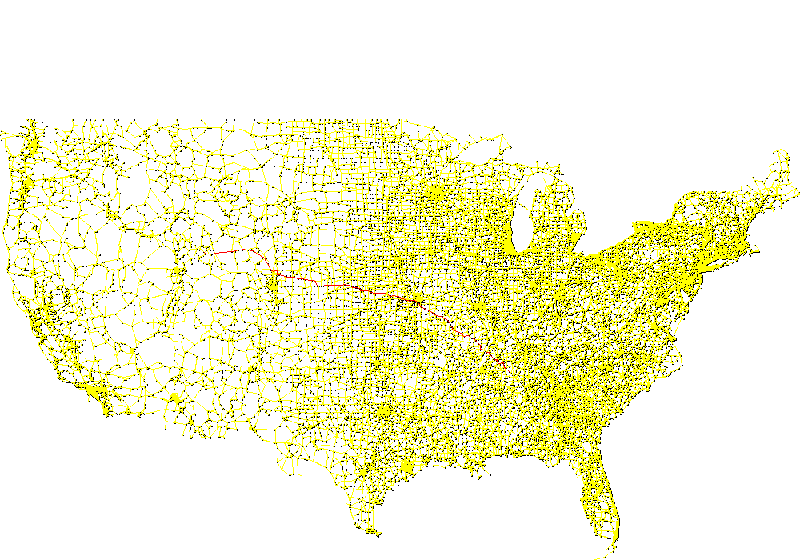
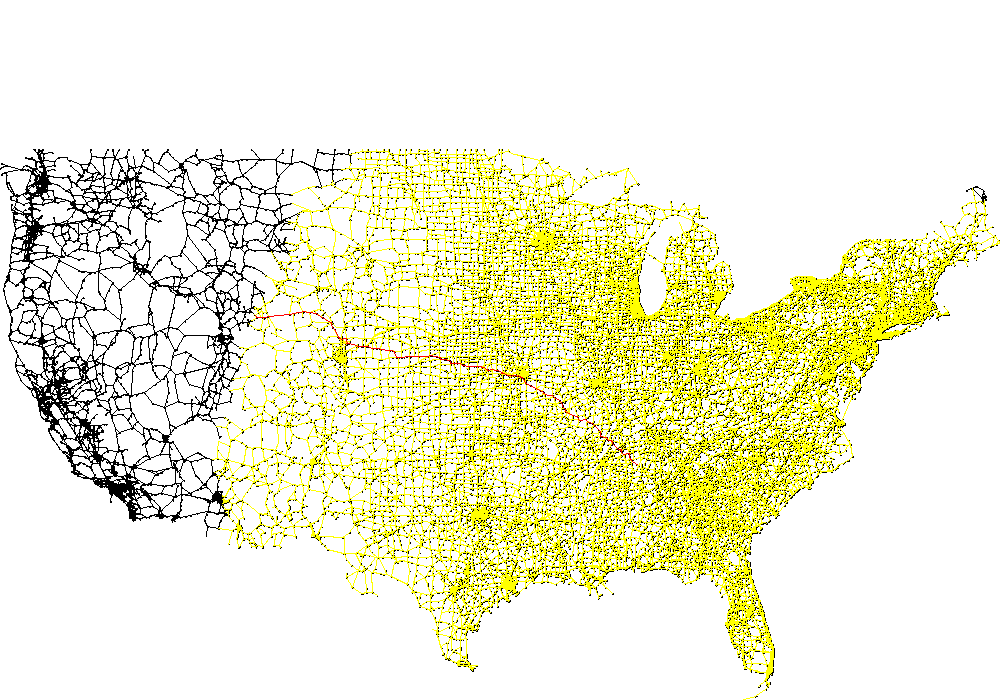
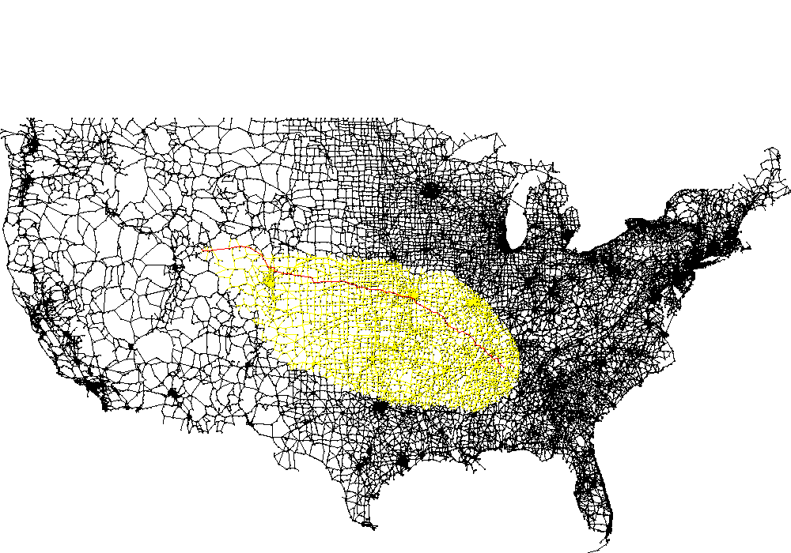

# 实验三 地图路由

20009200132 张明昊

## 一、实验要求

1. 实现经典的 Dijkstra 最短路径算法
2. 对其进行优化

## 二、实验过程

### 1. 实现基础的 Dijkstra 算法

维护两个数组，一个是 `s` 点到其他点的最短距离，一个是 `s` 点到某个点最短路径的前驱。一个优先队列，用于储存下一个节点。每次从优先队列取出一个节点 `v`，遍历与这个节点相邻的节点 `w`，如果 `d[v] + d(v, w) < d[w]`，那么就更新一下到这个节点的最短路径。如此循环直到优先队列为空证明所有节点都已经验证，或者遇到不可达节点，证明所有可达节点都以验证。

```java
protected void dijkstra(int s, int d, boolean draw) {
    int V = G.V();

    // initialize
    dist = new double[V];
    pred = new int[V];
    for (int v = 0; v < V; v++)
        dist[v] = INFINITY;
    for (int v = 0; v < V; v++)
        pred[v] = -1;

    // priority queue
    IndexPQ pq = new IndexPQ(V);
    for (int v = 0; v < V; v++)
        pq.insert(v, dist[v]);

    // set distance of source
    dist[s] = 0.0;
    pred[s] = s;
    pq.change(s, dist[s]);

    // run Dijkstra's algorithm
    while (!pq.isEmpty()) {
        int v = pq.delMin();
        // v not reachable from s so stop
        if (pred[v] == -1)
            break;

        // scan through all nodes w adjacent to v
        IntIterator i = G.neighbors(v);
        while (i.hasNext()) {
            int w = i.next();
            double newPath = dist[v] + G.distance(v, w);
            if (newPath < dist[w] - EPSILON) {
                dist[w] = newPath;
                pq.change(w, dist[w]);
                pred[w] = v;
            }
        }
    }
}
```

### 2. 优化一：发现目标点就停止

因为我们寻找的是两点之间的最短路径，所以找到目标点就可以退出程序了

```java
    while (!pq.isEmpty()) {
        …
        if (v == d || pred[v] == -1) {
            break;
        }
        …
    }
```

### 3. 优化二：使用多路堆优先队列

因为程序有大量出队和修改操作，使用更快的优先队列可以提升速度

```java
    MultiwayHeapIndexMinPQ<Double> pq = new MultiwayHeapIndexMinPQ<>(2, V);
```

### 4. 优化三：使用 A* 搜索

将 `d[w]` 更新为 `d[v] + d(v, w) + euclidean(w, d) - euclidean(v, d)`，这种启发式算法不会影响正确性，但是会大大提高性能。

```java
    while (!pq.isEmpty()) {
        int v = pq.delMin();
        if (v == d || pred[v] == -1) {
            break;
        }
        IntIterator i = G.neighbors(v);
        while (i.hasNext()) {
            int w = i.next();
            double newPath = dist[v] + G.distance(v, w) + G.distance(w, d) - G.distance(v, d);
            if (newPath < dist[w] - EPSILON) {
                pq.change(w, newPath);
                dist[w] = newPath;
                pred[w] = v;
            }
        }
    }
```

### 5. 优化四：减小初始化开销

记录哪些节点被访问过，只初始化访问过的节点。

```java
public Astar(EuclideanGraph G) {
    …
    dist = new double[V];
    pred = new int[V];
    for (int v = 0; v < V; v++)
        dist[v] = INFINITY;
    for (int v = 0; v < V; v++)
        pred[v] = -1;

}

@Override
protected void dijkstra(int s, int d, boolean draw) {

    …
    while (!changed.isEmpty()) {
        int v = changed.poll();
        dist[v] = Double.POSITIVE_INFINITY;
        pred[v] = -1;
    }
    …
            if (newPath < dist[w] - EPSILON) {

                if (dist[w] < INFINITY) {
                    pq.change(w, newPath);
                } else {
                    pq.insert(w, newPath);
                    changed.add(w);
                }
                dist[w] = newPath;
                pred[w] = v;
            }
    …
}
```

## 三、实验结果

### 1. 可视化结果



Dijkstra 搜索了整张地图



提前退出减少了一部分搜索



A* 减少了大部分搜索

### 2. 运行时间测试

Dijkstra

| Test Set      |  Time(s) |
| :------------ | -------: |
| us-10         |    0.270 |
| us-1000long   |   23.949 |
| us-5000short  |  117.186 |
| us-50000short | 1866.887 |

优化 Astar

| Test Set      | Time(s) |
| :------------ | ------: |
| us-10         |   0.061 |
| us-1000long   |   2.402 |
| us-5000short  |   4.502 |
| us-50000short |  41.084 |

优化 Astar 使用多路堆

| Test Set      | Time(s) |
| :------------ | ------: |
| us-10         |   0.066 |
| us-1000long   |   2.639 |
| us-5000short  |   4.682 |
| us-50000short |  42.741 |

可能因为算法无法利用多路堆的优势，反而因为更复杂的数据结构拖慢了速度，所以也不能不论什么情况都使用复杂的数据结构。
